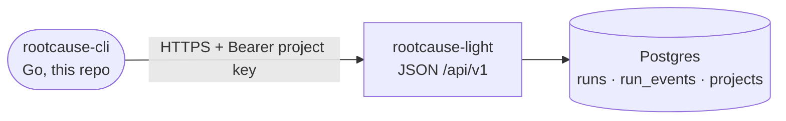

# Kickoff — rootcause-cli

**Status:** proposed · **Owner:** ops · **Throwaway** (delete once implemented; code + a `SKILL.md` are the durable record).

A small, developer-friendly **Go CLI** that lets a project **consume its own rootcause data** and
**change its own config** — a thin, scriptable client over rootcause-light's JSON `/api/v1`, authed with
the project's existing **Prompt API bearer key**. No logic of its own: every capability is a JSON endpoint
served by rootcause-light first.

> **The bet:** the users who want to will pull this in and slice their data the way *they* prefer (pipe to
> `jq`, scripts, a quick `rc run <id>`). It pairs with `rootcause-brain-skills`: before authoring an
> `action`, a dev runs e.g. `rc runs --limit 20` and `rc run <id> --events` to *verify against real runs*,
> then writes the action with confidence.

## Where this sits

One repo in the `rootcause-org` constellation (see rootcause-light's `AGENTS.md` for the full map):



The CLI talks **only** to rootcause-light's JSON API. It never touches Postgres, never holds business
logic. MCP is a **future** layer wrapping the same endpoints — explicitly out of v1.

## The four surfaces (progressive disclosure)

Same step-by-step mindset as the rest of rootcause: **index → one run → full detail**, so a customer never
gets a firehose. Each rung is one endpoint; the CLI is one command per rung.

| Rung | Endpoint | CLI | Status in rootcause-light |
|---|---|---|---|
| **index** (status-page-equivalent: recent runs + health summary, privacy-projected) | `GET /api/v1/runs` | `rc status` / `rc runs` | **GAP — build this.** Reuse `status.Categorize` + `ListRunsByProjectWindow` |
| **one run** (high level: status, kind, duration, draft?/note? booleans, error category) | `GET /api/v1/runs/{id}` | `rc run <id>` | **Exists** (`PromptReceiver.Status`, `internal/api/prompt.go`) |
| **full detail** (the jsonl: per-iteration reasoning + `bash` command + stdout/stderr) | `GET /api/v1/runs/{id}/events` | `rc run <id> --events` | **Exists** (`PromptReceiver.Events`) |
| **config** (read effective settings + box defaults; change model/cost-cap) | `GET` / `PATCH /api/v1/settings` | `rc config [get\|set]` | **Exists** (`internal/api/settings.go`) |

So the rootcause-light work is **one new endpoint** plus a DRY refactor; the CLI is otherwise a pure client.

## The DRY rule (the part that lands in rootcause-light)

> **One Go view-model per surface feeds HTML, markdown, AND JSON — never three renderers.**

The index is where this bites: today `internal/pages/status.go` builds privacy-projected run rows *inline*
for the HTML status page. Factor that row-building into a shared, pure function returning a
`[]RunSummary` (built from `ListRunsByProjectWindow` + `status.Categorize`); then the HTML template, the
markdown variant, and the new JSON `GET /api/v1/runs` all consume the **same** `[]RunSummary`. The
privacy projection (booleans + error *category*, never bodies/raw error) is enforced **in the model**, so
JSON inherits it for free.

The per-run rungs already share their model implicitly (the Prompt API `Status`/`Events` read the same
`runs`/`run_events` the run-trace HTML renders); leave them, just confirm the JSON shape is stable.

### Auth & scope (identical to Prompt/Settings API)

`Authorization: Bearer <project API key>` → resolves the project via `authenticate` (`prompt.go`); the key
**is** the scope — a run/setting only ever resolves within the key's own project. Missing/bad key →
`401 MISSING_API_KEY` / `BAD_API_KEY`. The bearer key sees its own project **fully** (it's the project's
own data) — distinct from the status page's separate HMAC token + operator/customer tiers, which stays as
is for link-sharing. The new `GET /api/v1/runs` mounts beside `POST /api/v1/runs` in `App.Routes`.

## The CLI (this repo)

| Aspect | Choice |
|---|---|
| **Language** | Go 1.25+ (matches the host; can later share DTO structs with rootcause-light if it pays off — start by copying the few response types). |
| **Framework** | `cobra` + `pflag` (the Go-CLI default). One thin `internal/client` HTTP wrapper. |
| **Binary** | `rc` (module `github.com/rootcause-org/rootcause-cli`). |
| **Config** | `ROOTCAUSE_API_KEY` + `ROOTCAUSE_BASE_URL` env, overridable by `~/.config/rootcause/config.toml` (`[default]` profile + named profiles for multiple projects/boxes) and `--profile`. The key resolves the project, so no `--project` flag. |
| **Output** | **TTY → pretty table; piped → JSON** (auto-detect). `-o json` / `-o table` forces. Every command can emit raw JSON so `\| jq` always works — the API "only returns JSON"; the CLI just *renders* it. |
| **Errors** | Surface the API's `{error:{code,message}}` verbatim; non-zero exit on `code`. A `403 FORBIDDEN_KEY` / `INVALID_SETTINGS` from `config set` prints the field errors plainly. |

### Commands (v1)

```
rc status                 # index: recent runs + health summary (GET /api/v1/runs)
rc runs [--limit N] [--kind email|prompt|mcp|analysis] [--category ok|timeout|...]
rc run <id>               # one run, high level
rc run <id> --events      # full detail: per-iteration reasoning + bash + stdout/stderr (jsonl-shaped)
rc config get             # effective settings + box defaults
rc config set max_run_usd=5 default_tier=pro    # PATCH; validate-then-apply, clear errors
rc --version | rc help
```

`rc status` and `rc runs` are the same endpoint (status is the no-filter default view). Drill-down mirrors
the API ladder exactly: a `rc status` row shows the run id → `rc run <id>` → `rc run <id> --events`.

## Scope guards (push back if asked)

- **No MCP in v1** (future layer over the same endpoints — keep commands mappable 1:1 to it).
- **No business logic / no DB access** — pure client; anything new is a JSON endpoint in rootcause-light first.
- **No write surface beyond `config set`** — the self-service settings whitelist *is* the boundary; the CLI
  never triggers runs, actions, or sends mail (those are ReplyPen / the action-gem / the Prompt API).
- **No new auth mechanism** — reuse the project's Prompt API bearer key.
- **No interactive TUI / dashboard** — scriptable, pipe-first, headless.

## Build plan

1. **rootcause-light:** factor the status row-builder into a shared `[]RunSummary` model (privacy projection
   in the model); add `GET /api/v1/runs` (bearer-authed, paginated `--limit`, `kind`/`category` filters)
   feeding off it; HTML page now consumes the same model. Table-tested + httptest, house style.
2. **rootcause-cli:** scaffold (`go mod`, cobra root, `internal/client`, config/profiles, TTY-aware output);
   wire the four commands; golden-file tests for table render + JSON passthrough against a stubbed server.
3. **Docs:** a `SKILL.md` in this repo + a one-liner in `rootcause-brain-skills` so the author→verify loop
   (`rc runs` → `rc run --events` → write action) is discoverable. Delete this kickoff spec once shipped.

## Open questions (decide at build time, don't block)

1. **Pagination** for `GET /api/v1/runs` — cursor vs `--limit/--offset`. Default: `--limit` (cap ~100) +
   an opaque `before=<run_id>` cursor; the status window query is already bounded.
2. **`--events` shape** — stream NDJSON (one event per line, jq-friendly) vs a JSON array. Lean NDJSON to
   match the "jsonl" mental model and stay streamable.
3. **DTO sharing** — copy response structs into the CLI now; extract a shared `rootcause-light/pkg/api`
   module only if drift becomes real (avoid premature coupling between repos).
